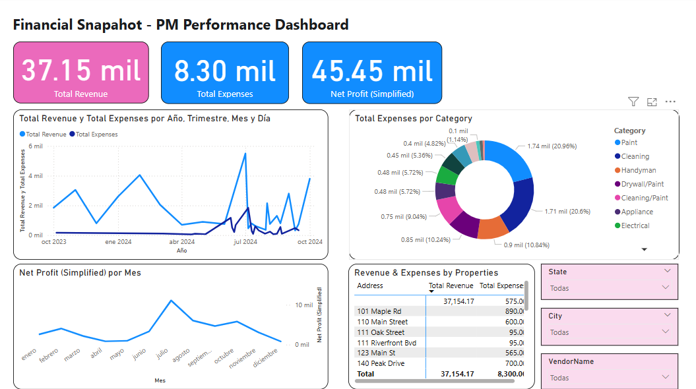

# Property Management Performance Dashboard (Simulated Data)

### **Project Goal:** To develop a comprehensive Business Intelligence dashboard for Property Management (PM) companies to track key operational and financial performance metrics, inspired by the business model and publicly available metrics of the most relevant properties managements consulting solutions.

## **Role:** Independent BI Consultant / Data Analyst

**Project Overview:**
This project demonstrates the end-to-end process of building a BI solution, starting from understanding business requirements to designing the data model, developing key performance indicators (KPIs) using DAX, and creating interactive dashboards for data-driven insights. The project simulates data based on the core operational workflows and financial metrics relevant to property management businesses, as identified through research and analysis of industry best practices.

### **Key Objectives Achieved:**

*   **Requirements Analysis:** Researched and defined key operational processes (e.g., Leasing, Turnover, Work Orders) and performance metrics based on business goals.
*   **Data Modeling:** Designed a relational data model representing core PM entities (Properties, Units, Leases, Work Orders, Applications, etc.) and their relationships.
*   **DAX Measure Development:** Created detailed DAX measures to quantify defined performance metrics (e.g., process speeds, conversion rates, financial performance).
*   **Dashboard Design:** Developed intuitive and interactive Power BI dashboards organized by functional area to visualize performance, identify trends, and highlight areas for improvement.

### **Methodology:**

1.  **Business Understanding:** Analyzed the core operations and value proposition of a data-driven PM consulting model
2.  **Data Structure Conceptualization:** Defined the necessary data entities and proposed a relational schema required to support the identified metrics. Simulated data in CSV format based on this schema.
3.  **Power BI Data Modeling:** Imported simulated data, cleaned data types, and established relationships between tables in Power BI Desktop.
4.  **DAX KPI Calculation:** Developed DAX measures using appropriate functions (`DATEDIFF`, `COUNTROWS`, `FILTER`, `AVERAGEX`, `CALCULATE`, etc.) to compute process speeds, rates, counts, and financial summaries.
5.  **Report & Dashboard Creation:** Organized measures and data into logical pages (dashboards) focusing on different aspects of PM performance (Executive Summary, Leasing, Maintenance, Turnover, Financial Snapshot) using a variety of Power BI visualizations.

### **Skills Demonstrated:**

*   Business Intelligence (BI)
*   Data Analysis
*   Data Modeling (Star Schema/Relational)
*   DAX (Data Analysis Expressions)
*   Data Visualization
*   Requirements Gathering (from business context/documentation)
*   Power BI Desktop

### **Deliverables:**

*   Conceptual Data Model Design
*   Simulated Dataset (CSV files based on defined structure)
*   Power BI .pbix file containing:
    *   Data Model
    *   Developed DAX Measures
    *   Interactive Dashboards (Executive Summary, Leasing, Maintenance, Turnover, Financial)
    
### Insights & Recommendations: Driving Profitability through Data

Developing dashboards is a critical step, but the real value of Business Intelligence lies in translating data visualizations into actionable insights that drive business outcomes. In this simulated project, I focused on using the generated metrics and dashboards to identify potential opportunities for improving a Property Management company's profitability, directly addressing the core goal highlighted by models that manage properties in an advanced and automated way.

Here are examples of insights that can be derived from the dashboards and corresponding potential recommendations:

*   **Identifying Bottlenecks in Turnover:**
    *   **Insight:** By analyzing the **"Turnover Speed (Days)"** dashboard and drilling down into individual turnover events or categories of work orders (`WorkOrders[Category]`), we might find that turnovers involving extensive painting or flooring repairs take significantly longer than average.
    *   **Recommendation:** This points to a bottleneck. As a consultant, I would recommend a deeper dive into the vendor performance for these specific categories, or potentially reviewing the internal scoping and approval process for these types of repairs.
    *   **Impact:** Reducing turnover time directly minimizes **"Days w/o Revenue (Leased Units)"**, leading to increased rental income for the owner and the PM company.

*   **Optimizing the Leasing Funnel:**
    *   **Insight:** The **"Leasing & Applications Performance"** dashboard provides key metrics like **"Applications per Lease Executed"** and **"Application Qualification Rate (%)"**. If "Applications per Lease Executed" is high, but "Application Qualification Rate (%)" is low, it suggests the marketing efforts are attracting many applicants, but they aren't meeting the criteria.
    *   **Recommendation:** This requires investigating the application criteria and comparing it to the applicant pool being attracted. It might lead to recommendations for adjusting marketing channels or refining screening requirements.
    *   **Impact:** Improving the qualification rate and the overall conversion funnel (visible via the steps measured in **"Speed to Application Selection/Lease Sent/Executed"**) reduces marketing costs per lease and speeds up the time to fill vacancies.
*   **Improving Communication Efficiency:**
    *   **Insight:** The **"Average Response Time"** and **"# Touches to Resolution"** metrics on the Communication dashboard highlight the efficiency of handling inquiries. A high number of touches for resolved tickets could indicate inefficient communication or unresolved underlying issues.
    *   **Recommendation:** Analyze threads with high touches to identify common themes or process breakdowns (e.g., delayed information from a vendor leading to multiple follow-ups). This could lead to recommendations for better internal communication protocols or improved vendor coordination.
    *   **Impact:** Faster and more efficient communication improves client (owner and tenant) satisfaction and reduces staff time spent on repetitive interactions, freeing up resources for other tasks.

*   **Connecting Operations to Financial Outcomes:**
    *   **Insight:** The **"Financial Snapshot"** dashboard, linked with operational data (e.g., `Total Expenses` by `WorkOrders[Category]`), clearly shows the cost associated with maintenance. High costs in a specific category, combined with slow **"Speed to Repair"**, suggest not only inefficiency but also potentially higher expense without correlating speed gains.
    *   **Recommendation:** Benchmark these costs and speeds against industry data and investigate outliers (vendors, units, or types of repairs) that are costing more or taking longer than expected.
    *   **Impact:** Optimizing maintenance processes reduces operational expenses, directly improving the **"Net Profit"**.

**Conclusion on Consulting Value:**

This project goes beyond simply reporting numbers. By structuring the data, defining relevant metrics, and visualizing them logically, the dashboard acts as a diagnostic tool. A consultant can leverage these insights to pinpoint specific operational weaknesses, propose targeted process improvements or resource reallocations, and quantify the potential positive impact on the PM company's financial performance. It provides the data foundation necessary for strategic decision-making and achieving the goal of increased profitability.

### **Screenshots:**

*   **Data Model View:**
   

*   **Example DAX Measures:**
    

    

*   **Executive Summary Dashboard:**
    

*   **Leasing & Applications Dashboard:**
    

*   **Maintenance & Work Order Dashboard:**
    

*   **Turnover & Vacancy Dashboard:**
    

*   **Financial Snapshot Dashboard:**
    

*   **Link to Project Files:** [Datasets] [PM Consulting Testing.pbix]
